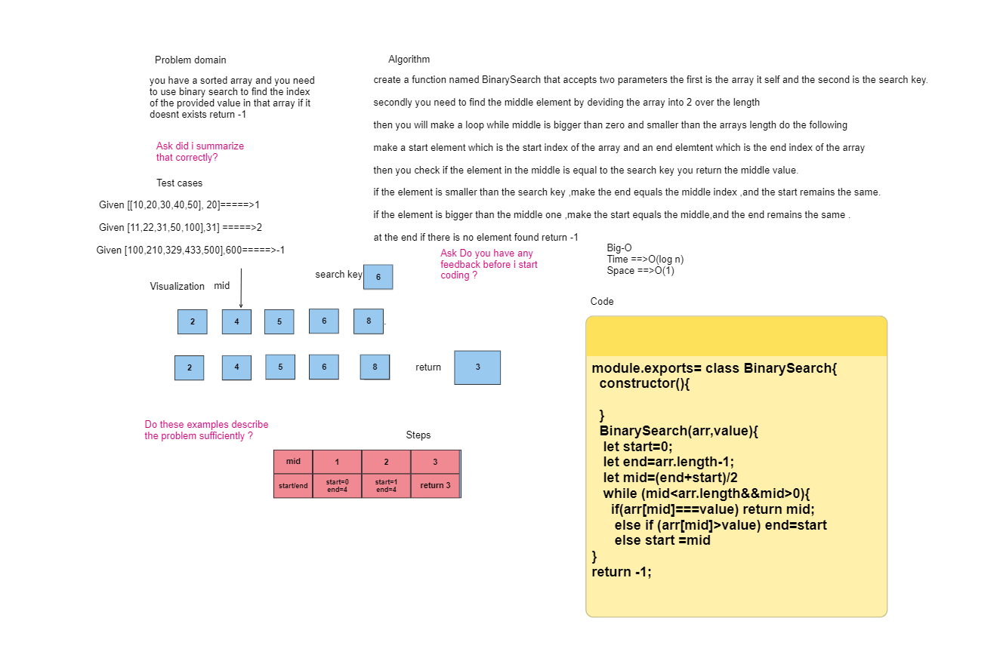

# Binary search

<you have a sorted array and you need to use binary search to find the index of the provided value in that array if it doesnt exists return -1

## Whiteboard Process

 

## Approach & Efficiency
>create a function named BinarySearch that accepts two parameters the first is the array it self and the second is the search key.

>secondly you need to find the middle element by deviding the array into 2 over the length then you will make a loop while middle is bigger than zero and smaller than the arrays length do the following

>make a start element which is the start index of the array and an end elemtent which is the end index of the array then you check if the element in the middle is equal to the search key you return the middle value

>if the element is smaller than the search key ,make the end equals the middle index ,and the start remains the same

>if the element is bigger than the middle one ,make the start equals the middle,and the end remains the same

>at the end if there is no element found return -1

### ****the Efficiency for time is O(log n),and for space is O(n)**

## Solution
<module.exports= class BinarySearch{
  constructor(){

  }\
  BinarySearch(arr,value){\
   let start=0;\
   let end=arr.length-1;\
   let mid=(end+start)/2\
   while (mid<arr.length&&mid>0){\
     if(arr[mid]===value) return mid;\
      else if (arr[mid]>value) end=start\
      else start =mid\
}\
return -1;\
    