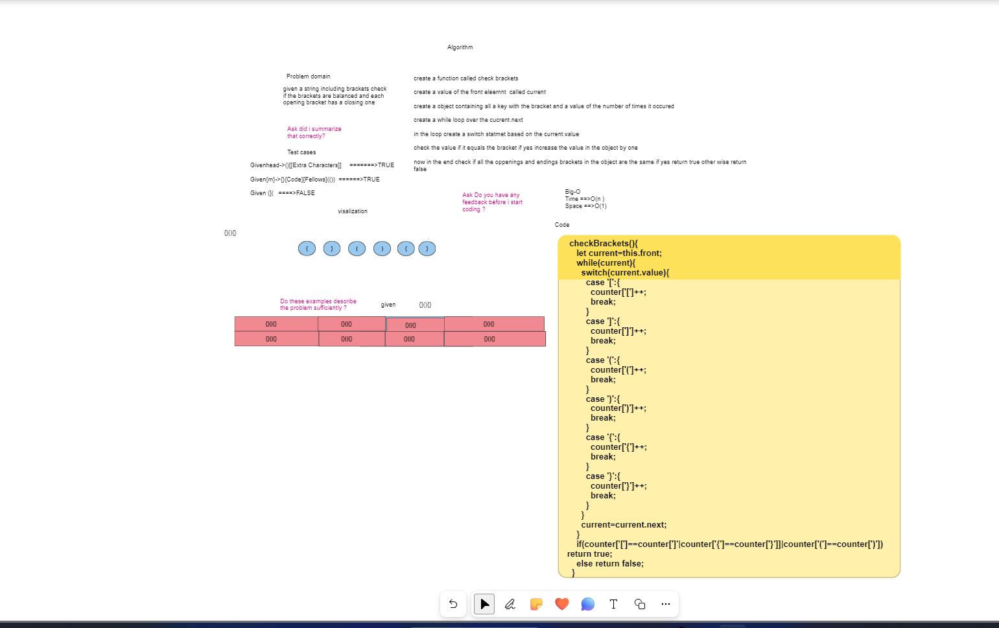

# Brackets

## In this code challange you are provieded a string that contains a set of brackets based and you need to check wheather the brackets are balanced or not

## I've created a a checkBrackets Function and tested all its funcionality in the test file and with a little help from our friend at Chatgpt

### Whiteboard Image 

#### PULL REQUEST

<>

