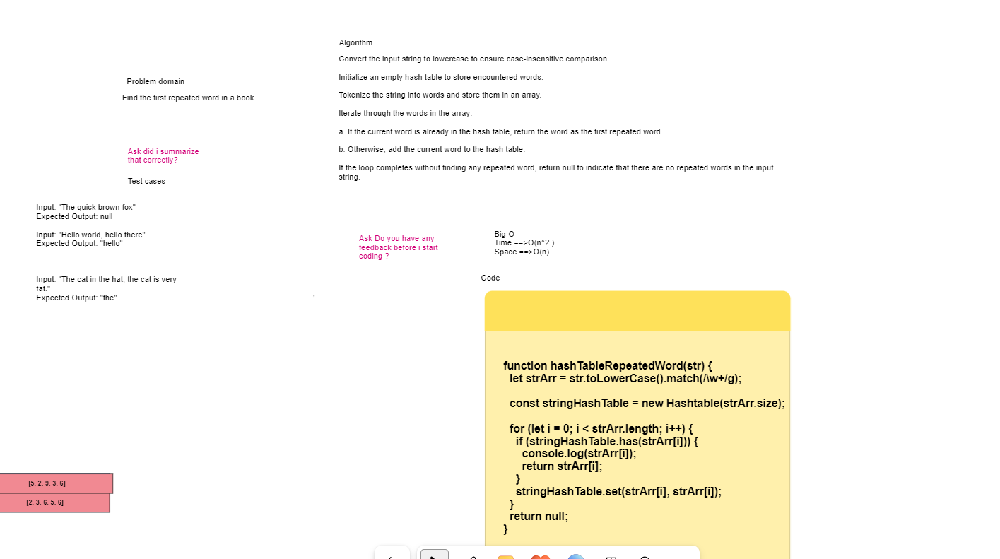

>## Hash Table:


> **WhiteBoard**
<>
> **Code**
```javascript

function hashTableRepeatedWord(str) {
  let strArr = str.toLowerCase().match(/\w+/g);

  const stringHashTable = new Hashtable(strArr.size);

  for (let i = 0; i < strArr.length; i++) {
    if (stringHashTable.has(strArr[i])) {
      console.log(strArr[i]);
      return strArr[i];
    }
    stringHashTable.set(strArr[i], strArr[i]);
  }
  return null;
}
```

## How it works in summary

>Convert the input string to lowercase to make it case-insensitive,Initialize an empty set (WordSet) to track encountered words,Tokenize the string into words and store them in an array, Iterate through the words,If the current word is in WordSet, return it as the first repeated word,Otherwise, add the word to WordSet,If no repeated words are found during the loop, return null.