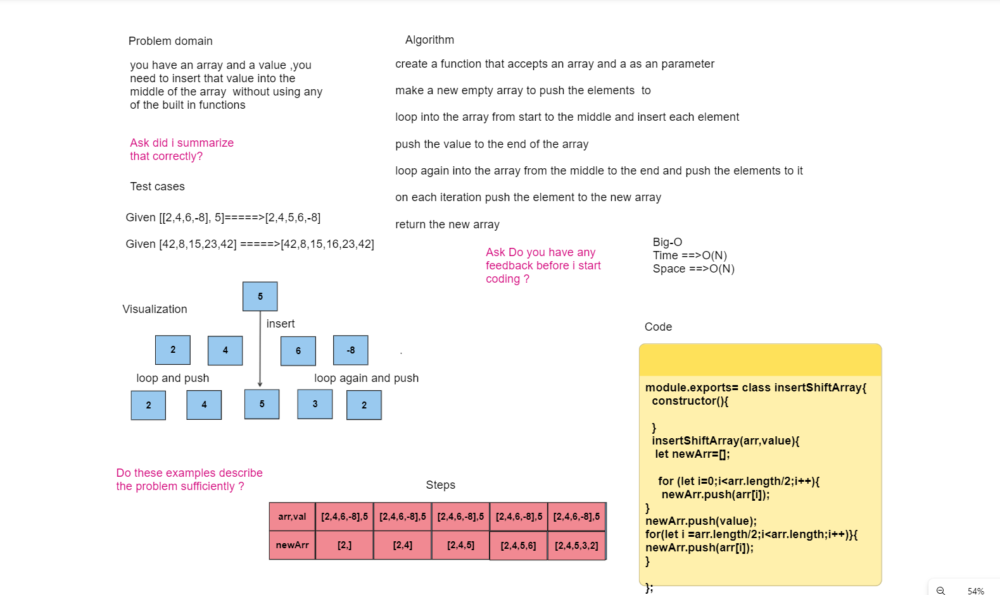

# Insert shift

## Whiteboard Process

 

## Approach & Efficiency

> i created a function and i looped into the array two times , the first time i inserted the values to the new array from start to middle,then i pushed the target value to the new array,then i looped again from mid to end and pushed the items again . 

## Solution

>
>module.exports= class insertShiftArray{
>  constructor(){}

  >insertShiftArray(arr,value){

   >let newArr=[];

    for (let i=0;i<arr.length/2;i++){
     newArr.push(arr[i]);
}

>newArr.push(value);

>for(let i =arr.length/2;i<arr.length;i++)}{

>newArr.push(arr[i]);
}

};

### to test my code go to the javascript file and run npm test and it should show you the test suite that i did for the application
