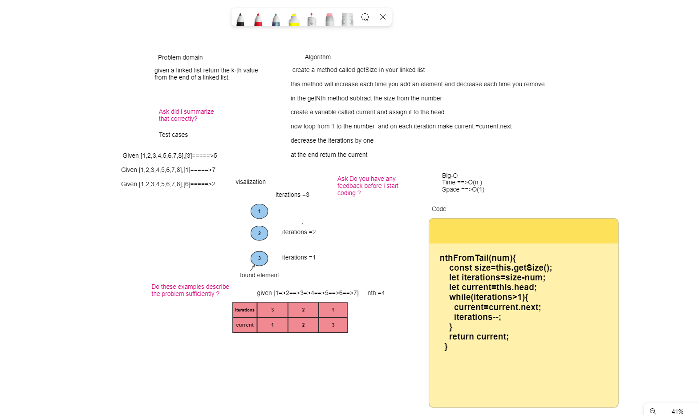
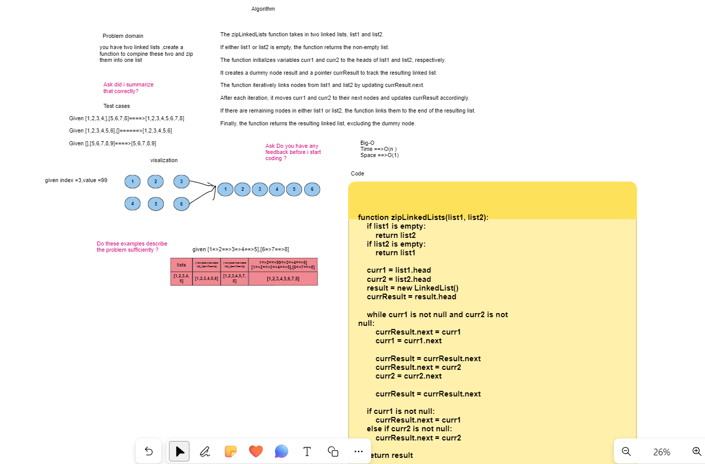

# Linkedlist

## Created two classes one for creating a node for the linkedlist and one for the linkedlist it self, the linkedlist has many methods and featuers including

1- Insert At the start\
2- Insert At the end\
3- get Head\
4- includes\
5- Print all data\
6- get size\ 
7- clear list

## code challange 06

## pull request for linked-list insert At and insert before and after 
<https://github.com/Armada6199/data-structures-and-algorithms/pull/9>

## code challange 07

### pull request for linked-list nth from end

<https://github.com/Armada6199/data-structures-and-algorithms/pull/8/>

## code challange 08 image 

### pull request 08

### readme

