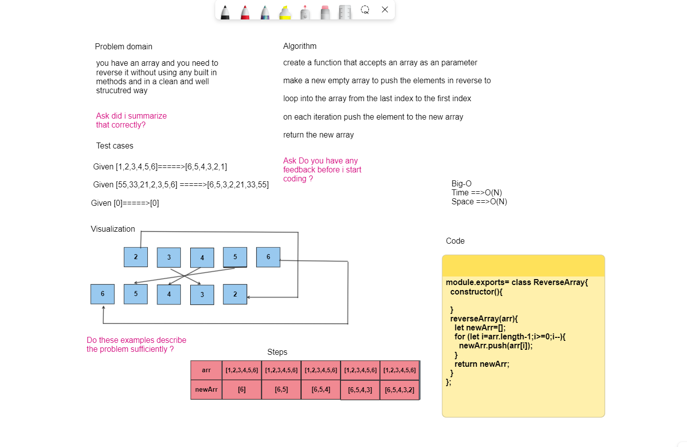

# Reverse Array

## Whiteboard Process

 

## Approach & Efficiency

### i created a new array and looped in the old array from last to first and on each iteration i push the item to the new array and then returned it , the space and time complixity is O(N) cause i am creating a new array with n elements and at worst case will do n operations .

## Solution

### to test my code go to the javascript file and run npm test and it should show you the test suite that i did for the application 

