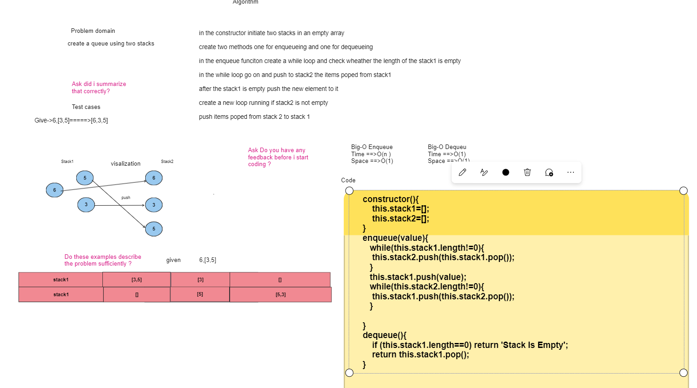

# Stack Queue Pseudo

## Today I have Created a   Queue from Two stacks

### To enqueu an element you first have to take the first stack loop over it and push everything in it to the other stack ,then push the target element to the first stack which is empty ,after that go on and push all the elements in the other stacks and pop them out to the first stack 

#### WhiteBoard Image

;

#### Pull Requeust

<https://github.com/Armada6199/data-structures-and-algorithms/pull/16/>

