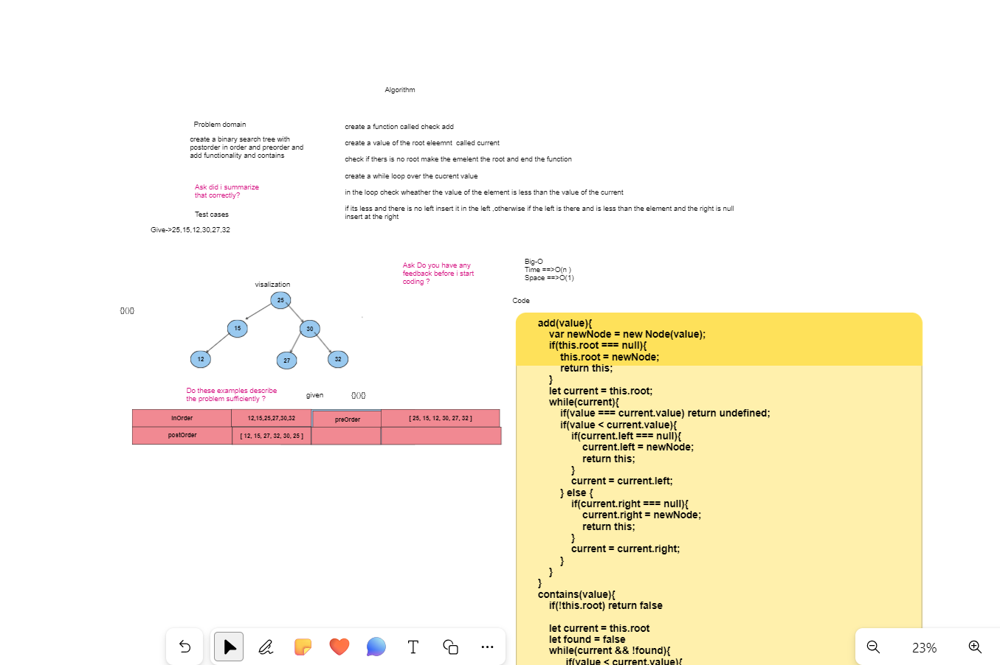

# TREES

## I've implemented Three Classes which are Node,Tree,BinaryTree which extends Tree class

### these classes have methods to print elements in order or postorder,or preorder

### Whiteboard Image

#### PULL Request

<https://github.com/Armada6199/data-structures-and-algorithms/pull/15>
